<!DOCTYPE html>
<html lang="en">
<head>
<meta charset="UTF-8">
<meta name="viewport" content="width=device-width, initial-scale=1.0">
<title>CozyStitch Threads | Handmade Crochet Creations</title>
<meta name="description" content="Handmade crochet bags, scarves, baby wear and more from CozyStitch Threads. Order directly on WhatsApp.">
<meta property="og:title" content="CozyStitch Threads | Handmade Crochet Creations">
<meta property="og:description" content="Handmade crochet bags, scarves, baby wear and more. Order directly on WhatsApp.">
<meta property="og:image" content="logo2.png">
<meta property="og:type" content="website">
<link rel="icon" type="image/png" href="logo2.png">

</head>
<body>

<header class="site-header">
  

    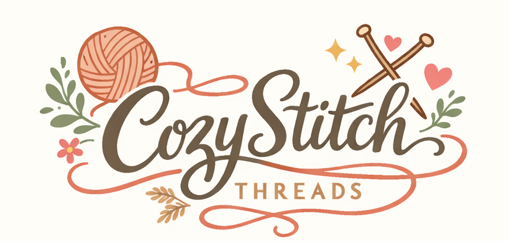
  

</header>

<header class="intro">
  <h2 class="tagline">Handmade Crochet Creations</h2>
</header>

<!-- IMAGE POPUP -->

  &times;
  

  <h2 class="section-title">Our Products</h2>

  <!-- CATEGORY FILTERS -->
  

    <button class="filter-btn active" data-filter="all">All</button>
    <button class="filter-btn" data-filter="bags">Bags &amp; Pouches</button>
    <button class="filter-btn" data-filter="scarves">Scarves</button>
    <button class="filter-btn" data-filter="baby">Baby Wear</button>
    <button class="filter-btn" data-filter="women">Women's Wear</button>
    <button class="filter-btn" data-filter="blankets">Blankets</button>
  

  

    

      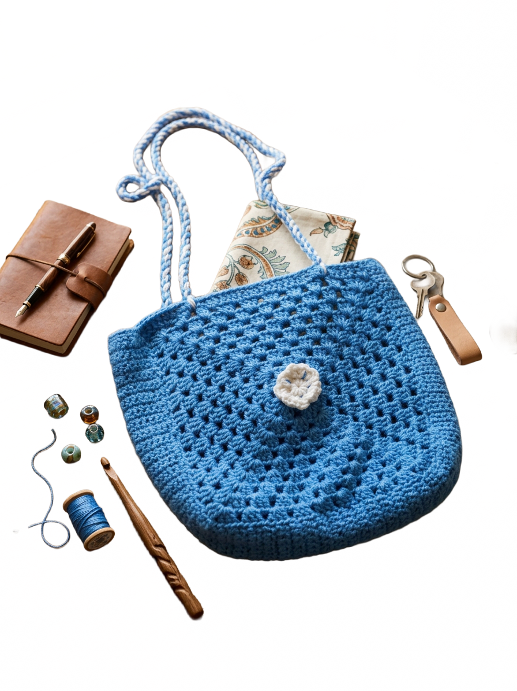
      <h3>Crochet Handbag</h3>
      
₹499

      <a class="order-btn" target="_blank" rel="noopener" href="https://wa.me/91XXXXXXXXXX?text=Hi!%20I'm%20interested%20in%20the%20Crochet%20Handbag%20(%E2%82%B9499).">Order on WhatsApp</a>
    

    

      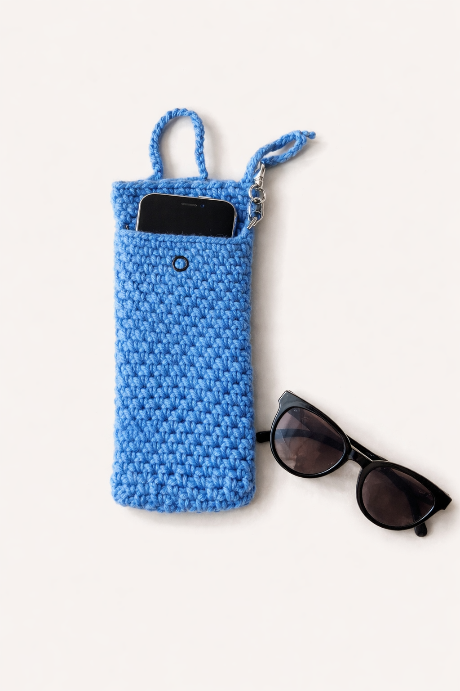
      <h3>Mobile / Sunglass Pouch — Classic</h3>
      
₹199

      <a class="order-btn" target="_blank" rel="noopener" href="https://wa.me/91XXXXXXXXXX?text=Hi!%20I'm%20interested%20in%20the%20Mobile%2FSunglass%20Pouch%20-%20Classic%20(%E2%82%B9199).">Order on WhatsApp</a>
    

    

      
      <h3>Mobile / Sunglass Pouch — Sling Style</h3>
      
₹199

      <a class="order-btn" target="_blank" rel="noopener" href="https://wa.me/91XXXXXXXXXX?text=Hi!%20I'm%20interested%20in%20the%20Mobile%2FSunglass%20Pouch%20-%20Sling%20Style%20(%E2%82%B9199).">Order on WhatsApp</a>
    

    

      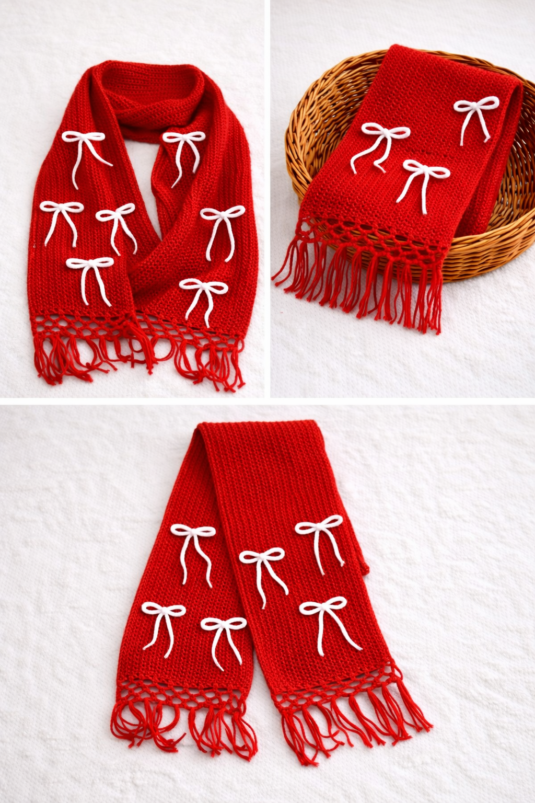
      <h3>Winter Scarf with Bow — Red</h3>
      
₹499

      <a class="order-btn" target="_blank" rel="noopener" href="https://wa.me/91XXXXXXXXXX?text=Hi!%20I'm%20interested%20in%20the%20Winter%20Scarf%20with%20Bow%20-%20Red%20(%E2%82%B9499).">Order on WhatsApp</a>
    

    

      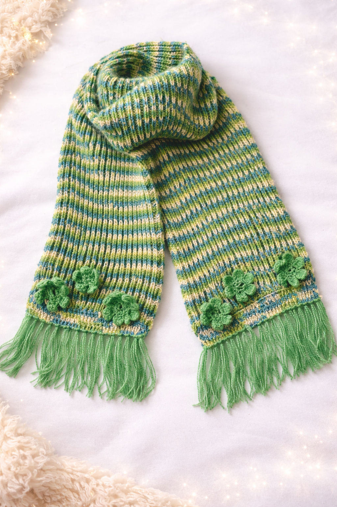
      <h3>Winter Scarf — Green</h3>
      
₹499

      <a class="order-btn" target="_blank" rel="noopener" href="https://wa.me/91XXXXXXXXXX?text=Hi!%20I'm%20interested%20in%20the%20Winter%20Scarf%20-%20Green%20(%E2%82%B9499).">Order on WhatsApp</a>
    

    

      
      <h3>Winter Scarf — White</h3>
      
₹499

      <a class="order-btn" target="_blank" rel="noopener" href="https://wa.me/91XXXXXXXXXX?text=Hi!%20I'm%20interested%20in%20the%20Winter%20Scarf%20-%20White%20(%E2%82%B9499).">Order on WhatsApp</a>
    

    

      
      <h3>Winter Scarf with Bow — White</h3>
      
₹499

      <a class="order-btn" target="_blank" rel="noopener" href="https://wa.me/91XXXXXXXXXX?text=Hi!%20I'm%20interested%20in%20the%20Winter%20Scarf%20with%20Bow%20-%20White%20(%E2%82%B9499).">Order on WhatsApp</a>
    

    

      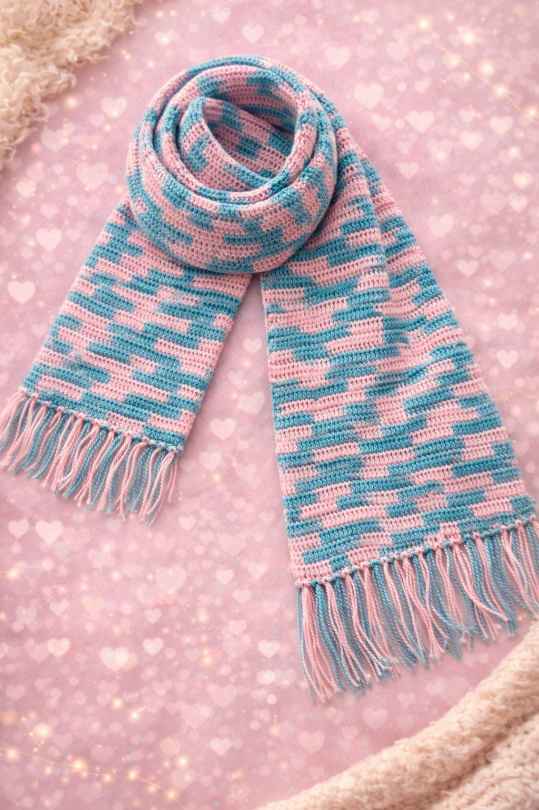
      <h3>Winter Scarf — Blue &amp; Pink</h3>
      
₹499

      <a class="order-btn" target="_blank" rel="noopener" href="https://wa.me/91XXXXXXXXXX?text=Hi!%20I'm%20interested%20in%20the%20Winter%20Scarf%20-%20Blue%20%26%20Pink%20(%E2%82%B9499).">Order on WhatsApp</a>
    

    

      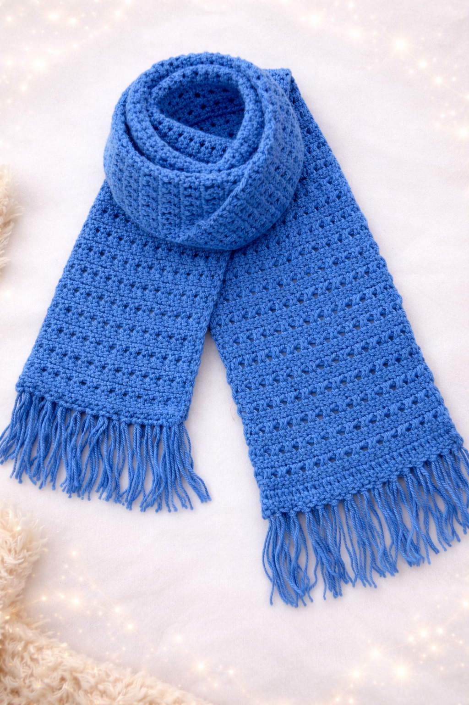
      <h3>Winter Scarf — Blue</h3>
      
₹499

      <a class="order-btn" target="_blank" rel="noopener" href="https://wa.me/91XXXXXXXXXX?text=Hi!%20I'm%20interested%20in%20the%20Winter%20Scarf%20-%20Blue%20(%E2%82%B9499).">Order on WhatsApp</a>
    

    

      
      <h3>Crochet Sling Bag</h3>
      
₹399

      <a class="order-btn" target="_blank" rel="noopener" href="https://wa.me/91XXXXXXXXXX?text=Hi!%20I'm%20interested%20in%20the%20Crochet%20Sling%20Bag%20(%E2%82%B9399).">Order on WhatsApp</a>
    

    

      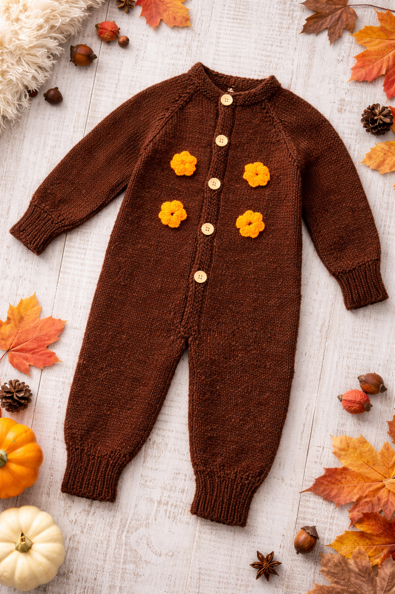
      <h3>Baby Jumpsuit — Brown</h3>
      
₹499

      <a class="order-btn" target="_blank" rel="noopener" href="https://wa.me/91XXXXXXXXXX?text=Hi!%20I'm%20interested%20in%20the%20Baby%20Jumpsuit%20-%20Brown%20(%E2%82%B9499).">Order on WhatsApp</a>
    

    

      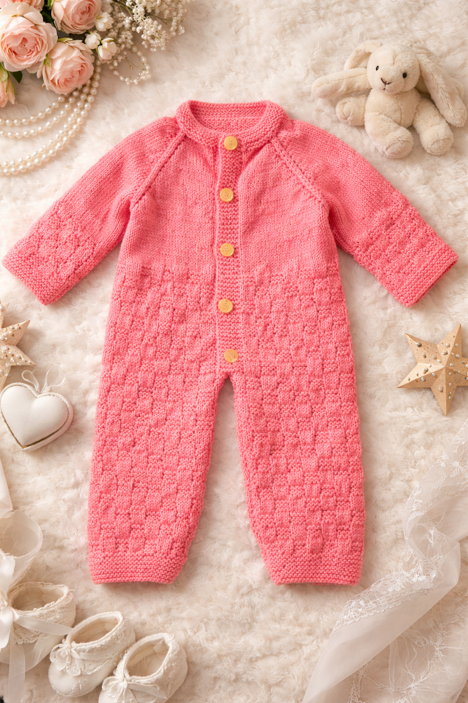
      <h3>Baby Jumpsuit — Orange</h3>
      
₹499

      <a class="order-btn" target="_blank" rel="noopener" href="https://wa.me/91XXXXXXXXXX?text=Hi!%20I'm%20interested%20in%20the%20Baby%20Jumpsuit%20-%20Orange%20(%E2%82%B9499).">Order on WhatsApp</a>
    

    

      
      <h3>Baby Dress with Cap &amp; Socks — Red &amp; White</h3>
      
₹499

      <a class="order-btn" target="_blank" rel="noopener" href="https://wa.me/91XXXXXXXXXX?text=Hi!%20I'm%20interested%20in%20the%20Baby%20Dress%20-%20Red%20%26%20White%20(%E2%82%B9499).">Order on WhatsApp</a>
    

    

      
      <h3>Baby Dress with Cap &amp; Socks — White</h3>
      
₹499

      <a class="order-btn" target="_blank" rel="noopener" href="https://wa.me/91XXXXXXXXXX?text=Hi!%20I'm%20interested%20in%20the%20Baby%20Dress%20-%20White%20(%E2%82%B9499).">Order on WhatsApp</a>
    

    

      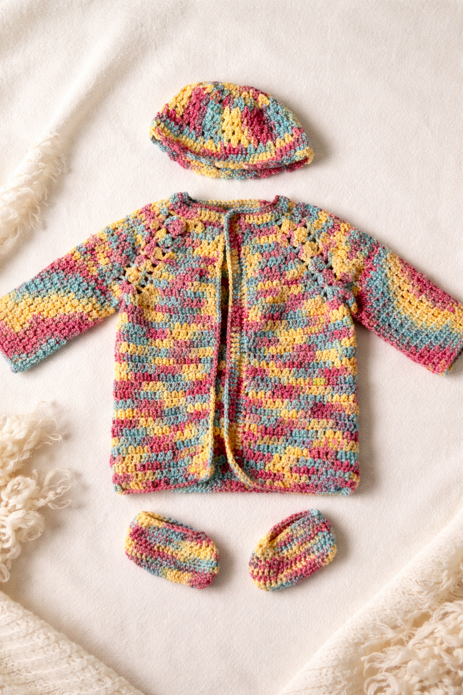
      <h3>Baby Jacket with Cap &amp; Socks — Multicolor</h3>
      
₹499

      <a class="order-btn" target="_blank" rel="noopener" href="https://wa.me/91XXXXXXXXXX?text=Hi!%20I'm%20interested%20in%20the%20Baby%20Jacket%20-%20Multicolor%20(%E2%82%B9499).">Order on WhatsApp</a>
    

    

      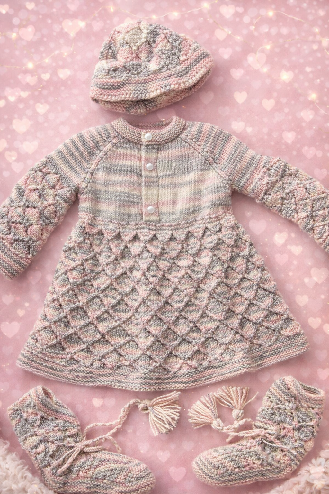
      <h3>Baby Jacket with Cap &amp; Socks — Ombre</h3>
      
₹499

      <a class="order-btn" target="_blank" rel="noopener" href="https://wa.me/91XXXXXXXXXX?text=Hi!%20I'm%20interested%20in%20the%20Baby%20Jacket%20-%20Ombre%20(%E2%82%B9499).">Order on WhatsApp</a>
    

    

      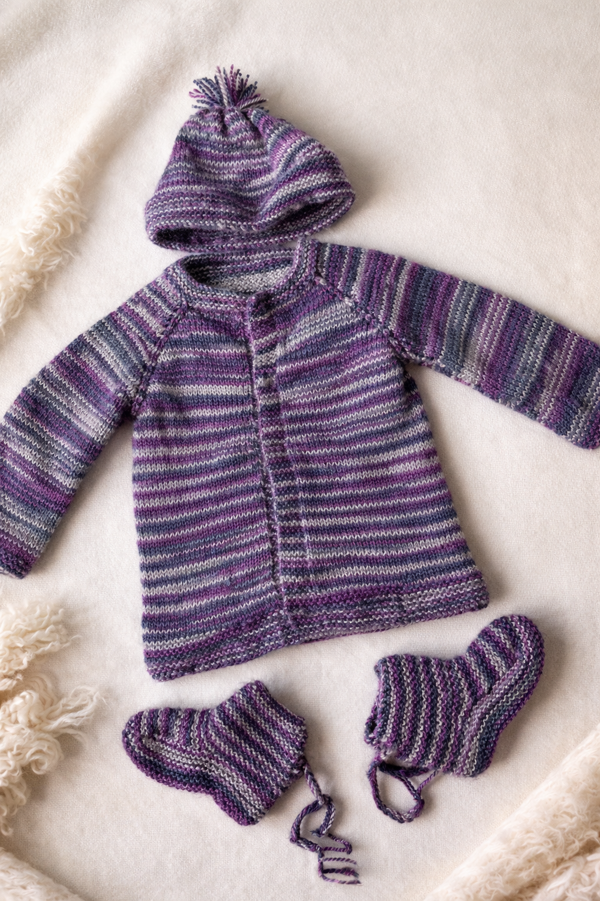
      <h3>Baby Sweater with Cap &amp; Socks — Blue</h3>
      
₹499

      <a class="order-btn" target="_blank" rel="noopener" href="https://wa.me/91XXXXXXXXXX?text=Hi!%20I'm%20interested%20in%20the%20Baby%20Sweater%20-%20Blue%20(%E2%82%B9499).">Order on WhatsApp</a>
    

    

      
      <h3>Small Baby Sweater with Cap — Purple</h3>
      
₹399

      <a class="order-btn" target="_blank" rel="noopener" href="https://wa.me/91XXXXXXXXXX?text=Hi!%20I'm%20interested%20in%20the%20Small%20Baby%20Sweater%20-%20Purple%20(%E2%82%B9399).">Order on WhatsApp</a>
    

    

      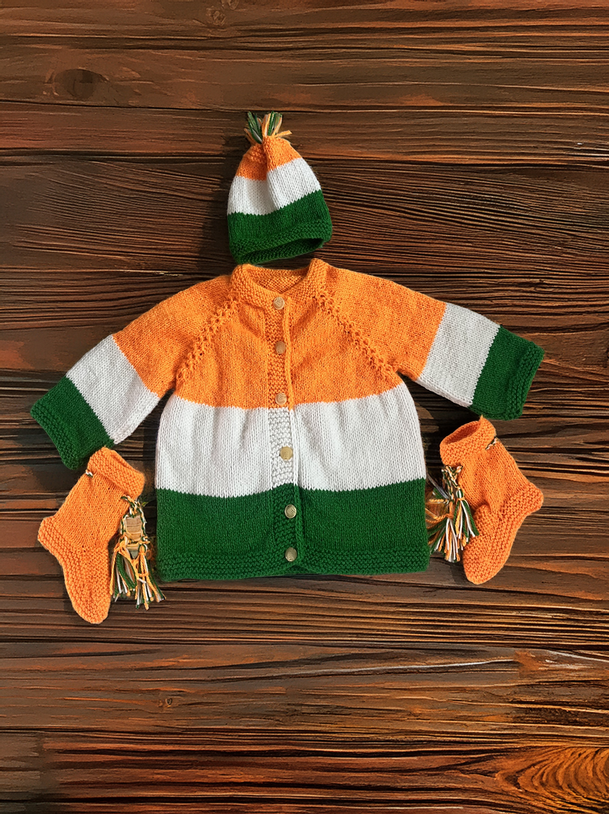
      <h3>Tricolour Baby Sweater with Cap &amp; Socks</h3>
      
₹499

      <a class="order-btn" target="_blank" rel="noopener" href="https://wa.me/91XXXXXXXXXX?text=Hi!%20I'm%20interested%20in%20the%20Tricolour%20Baby%20Sweater%20(%E2%82%B9499).">Order on WhatsApp</a>
    

    

      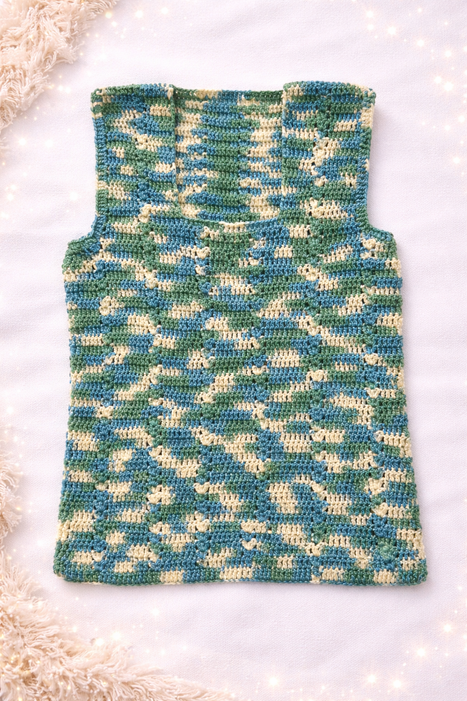
      <h3>Women's Top</h3>
      
₹499

      <a class="order-btn" target="_blank" rel="noopener" href="https://wa.me/91XXXXXXXXXX?text=Hi!%20I'm%20interested%20in%20the%20Women's%20Top%20(%E2%82%B9499).">Order on WhatsApp</a>
    

    

      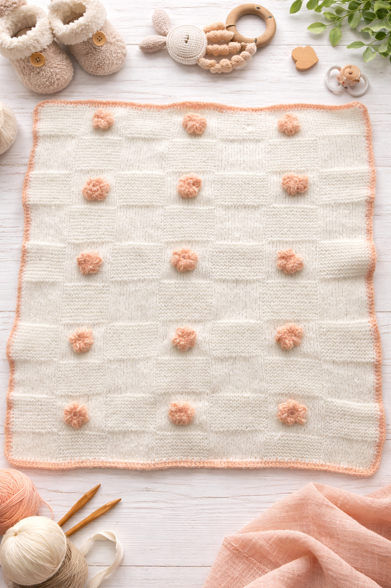
      <h3>Baby Blanket — Small</h3>
      
₹799

      <a class="order-btn" target="_blank" rel="noopener" href="https://wa.me/91XXXXXXXXXX?text=Hi!%20I'm%20interested%20in%20the%20Baby%20Blanket%20-%20Small%20(%E2%82%B9799).">Order on WhatsApp</a>
    

    

      
      <h3>Baby Blanket — Large</h3>
      
₹999

      <a class="order-btn" target="_blank" rel="noopener" href="https://wa.me/91XXXXXXXXXX?text=Hi!%20I'm%20interested%20in%20the%20Baby%20Blanket%20-%20Large%20(%E2%82%B9999).">Order on WhatsApp</a>
    

  

  
No products in this category yet.

<footer>
  
Interested in ordering?

  <a class="whatsapp" target="_blank" rel="noopener" href="https://wa.me/91XXXXXXXXXX?text=Hi!%20I'd%20like%20to%20know%20more%20about%20CozyStitch%20Threads.">Contact on WhatsApp</a>
  
© 2026 CozyStitch Threads

</footer>

</body>
</html>
